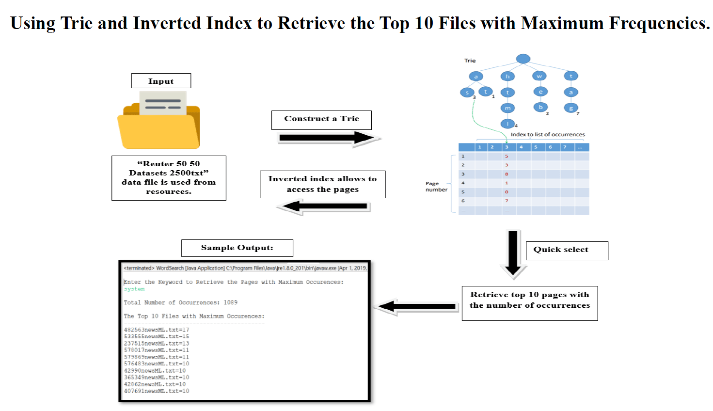
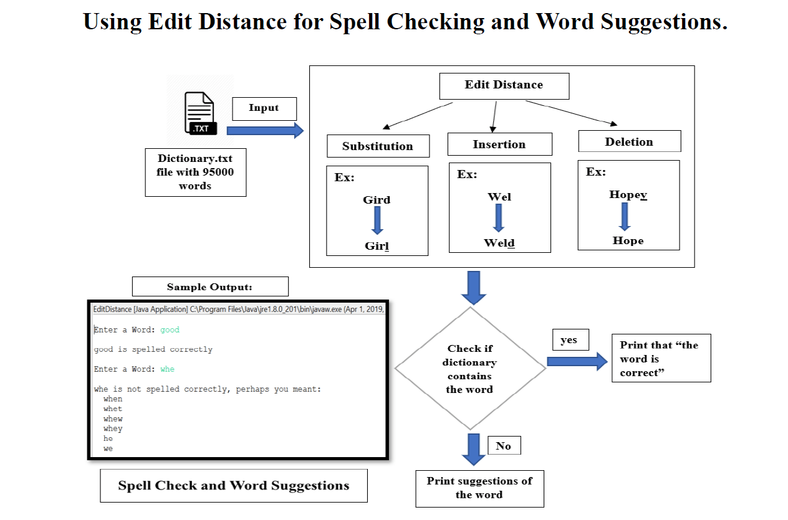
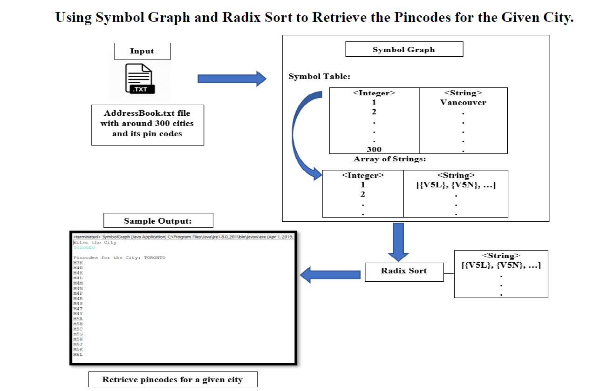
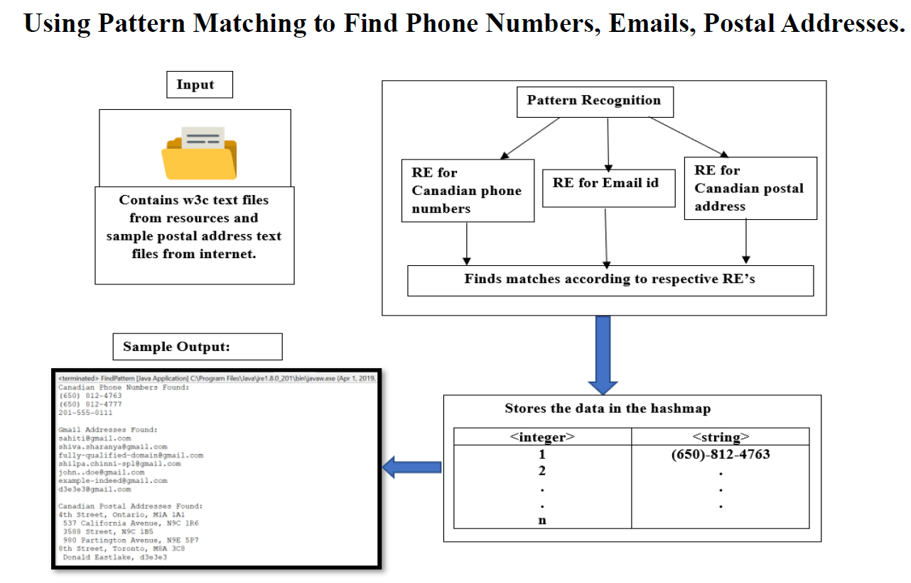

# WEB SEARCH ENGINE

> A Web Search Engine using Trie and Quick Select to retrieve the top 10 files with maximum occurrences of the search word, Edit Distance for Spell Checking, Symbol Graph and Radix Sort to store and retrieve pin codes of cities, Pattern Matching for finding desired patterns of phone no, email

## Table of contents
* [Technologies](#technologies)
* [Snapshots](#snapshots)
* [Contact](#contact)

## Technologies
* Technologies - Java

## Snapshots
 

## Contact
[Hemanth Kumar Woraram](https://hemanthkumarw.com/) - feel free to contact me!
